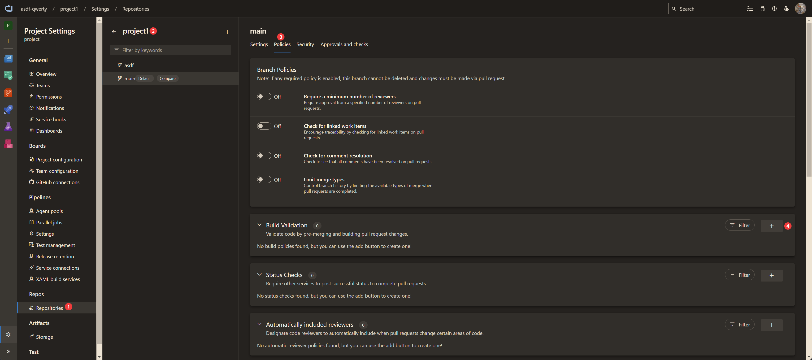
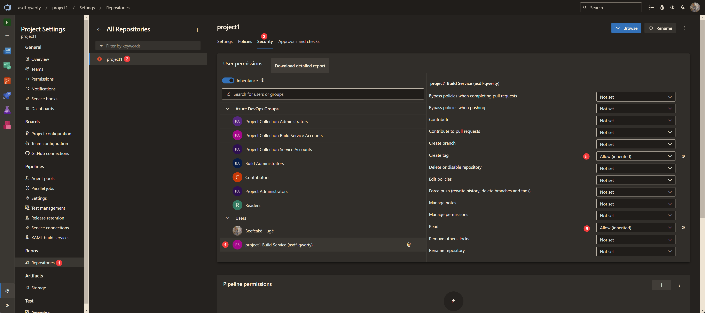

# Azure DevOps Tagging

**_TL/DR; Tag repos properly... and stuff_**

As a consultant I often see encounter clients that aren't tracking their code evolution properly. Sure they use Git and it has history, but I frequently seem clients trawling through commits trying to find code that had recently been deployed to develop or pre-production; or worse, trying to find out what was in a release that was deployed to production 6 months ago. Obviously one of the first thing that stands out to track code is via version tags, but even these can often go awry, as they are often manually applied and can be forgotten.

Automation. It's usually the key to solving these problems, and in this case it's no different. Here I'll show some scripts that can be used to tag your repos automatically. It's not a one size fits all solution, but understanding the concepts will help you to build your own solution that fits your needs.

I'll be using Azure Bicep as the language for my example just because I've been using it with a client for the last 2+ years, and it's what I wrote the scripts around, but the same principles can be applied to any language.

### Sementic Versioning

For this article you'll should be familiar with the concept of [Semantic Versioning](https://semver.org/). It's a standard that is used by many software companies to track the version of your code in a way that is easy to understand and follow. It's not a requirement for this article, but it's a good idea to understand it if you don't already.


## Example Bicep code

Personally I like to track/document the version of the code as close to the code as possible; for Bicep I creat a variable which represents the current version of the code, and also create a Markdown file identifying the changes made. I then use that variable and extract it's value to use as the tag for the repo. For one of my clients we transfromed the Bicep code into an ARM template and then deployed as a Template Spec file in Azure. We then used the same veriable to version the resource in Azure so we had a single source of truth for the version of the code when it was deployed.

```bicep
var v_templateDescription = 'Deployment of the hub platform'
var v_templateDisplayName = 'hubPlatform'
var v_templateName        = 'hubPlatform'
var v_templateVersion     = '2.1.0'
var v_templateTags        = {
    tsName   : v_templateName
    tsVersion: v_templateVersion
}
```

_Note the use of the `v_templateTags` variable, it's a map that I use to store the version in tags to every resource in the template. Handy for knowing what version of the template was used to deploy the resource at a glance in the portal._


## Raising a PR

The first step to tagging correctly is ensuring the PR you are raising for new code pulls in the variable and adds it to the PR tags. You can add any number of tags to a PR, so if you raise a PR with more than one Bicep file/module changed you can add a tag for each one.

For our project we had a pipeline that automatically ran whenever a PR was raised. This pipeline would perform some basic tests on the code for various other checks, and it also built the code (using `bicep build`) to extract the version from the variable. It would then add the version as a tag to the PR. For each Bicep file/module changed it would add a tag to the PR.

You can set automatic pipeline runs for PRs via the repository settings in Azure DevOps:



### PR Tag code:

```powershell
$PSVersionTable
$ErrorActionPreference = "Stop"


$sourceBranch = $(${Env:SYSTEM_PULLREQUEST_SOURCEBRANCH} -split "refs/heads/")[-1]


# We need to checkout the branch in order to compare the differences in files changed from develop branch
Set-Location -Path "${Env:SYSTEM_DEFAULTWORKINGDIRECTORY}/${Env:BUILD_REPOSITORY_NAME}"
git checkout $sourceBranch


Write-Host  "##[debug]🐞`tModifed files are"
git diff origin/develop $sourceBranch --name-only


$myList = @()
git diff origin/develop $sourceBranch --name-only |
    Select-String -Pattern "^bicep/\w+/" -Raw |
        ForEach-Object {
            $thisValue = $_.Split("/")[1]

            if($thisValue -notin $myList) {
                $myList += $thisValue
            }
        }


Write-Host  "##[debug]🐞`tBicep modified folders"
$myList


$myTagList = @()
foreach($item in $myList) {
    # we need to build the Bicep files in order to pull out the template name and version
    Write-Host  "`n##[debug]🐞`tCurrent bicep folder is ${item}"
    Set-Location -Path "${Env:SYSTEM_DEFAULTWORKINGDIRECTORY}/${Env:BUILD_REPOSITORY_NAME}/bicep/${item}"
    az bicep build --file main.bicep

    $myPsObject = Get-Content -Path "main.json" | ConvertFrom-Json
    $myTagList += "$($myPsObject.variables.v_templateName)-v$($myPsObject.variables.v_templateVersion)"
}

Write-Host  "`n##[debug]🐞`tThe tag list is:"
$myTagList


$apiUrl   = "${Env:SYSTEM_TEAMFOUNDATIONSERVERURI}${Env:SYSTEM_TEAMPROJECTID}/_apis/git/repositories/${Env:BUILD_REPOSITORY_NAME}/pullRequests/${Env:SYSTEM_PULLREQUEST_PULLREQUESTID}/labels"
$headers  = @{ Authorization = "Bearer ${Env:SYSTEM_ACCESSTOKEN}" }
Write-Host "API URL = ${apiURL}"


$url      = "${apiUrl}?api-version=7.1-preview.1"
$response = Invoke-RestMethod -uri $url -Method "GET" -Headers $headers
$tagids   = $response.value.id

Write-Host  "`n##[debug]🐞`tTag IDs are:"
$tagids


if($null -ne $tagids) {
    foreach($tagid in $tagids) {
        Write-Host  "`n##[debug]🐞`tDeleting tag id `"${tagid}`""
        $url      = "${apiUrl}/${tagid}?api-version=7.1-preview.1"
        $response = Invoke-RestMethod -uri $url -Method "DELETE" -Headers $headers
    }
}


foreach($tag in $myTagList) {
    Write-Host  "`n##[debug]🐞`tTagging PR with tag `"${tag}`""
    $body    = @{
        name = "${tag}"
    } | ConvertTo-Json

    $url      = "${apiUrl}?api-version=7.1-preview.1"
    $response = Invoke-RestMethod -uri $url -Method "POST" -ContentType "application/json" -Headers $headers -body $body
}
```

In order to identify what files have been changed between branches we use some basic Git commands. Essentially we get the list of files changed between the source and target branches, and then filter that list to only include Bicep files. We then loop through that list, `bicep build` each `main.bicep` file to JSON, convert it to a PowerShell object, and then extract the version from each file to add it as a tag to the PR. Note that we use regex to pattern match Bicep files that are in sub-folders so we target only those files. Your regex will vary depending on your folder structure; if you are unfamiliar with regex then I suggest you use a have a look at [RegExr](https://regexr.com/) to help you build your regex.

Once we have the file names and their version(s) we need to add it to the PR as a tag. Now the odd thing about Azure DevOps is that in the portal it shows as tags, but for the API call to AzDo tags they are represented as `labels`. Which is not entirely clear, but that's Microsoft for you. Once we know the API we need to call, we just need to push the object to AzDo with the required information. Do note that I'm using environment variables available within the pipeline to populate the required information, such as URL and authentication. You can find more about predefined variables from here: https://learn.microsoft.com/en-us/azure/devops/pipelines/build/variables

In order to use the agent to authenticate with AzDo you need to enable the build agent within the security settings of the project repository:



You'd be forgiven for thinking that you just need to make an API call to the same URL each time when a PR is raised and that's it. But soon you will notice that if someone makes a change to the code and pushes it whilst the PR is still open, it'll go ahead and run the build validation again, and re-tag the PR 'again'. Each time a the pipeline will run it will fail on tagging the PR because it already has the same tag on it. Also, what happens if you remove the changes to some Bicep files and thus remove any changes to that release, but others are still valid? You'll still have the old tag there which isn't valid. A keen eye will notice in my code that each time it is run it will remove all existing tags first before adding new ones, ensuring the tags are always up to date and accurate.


## Merging to Main or Develop Branch

Once the PR is approved and merged to the main or develop branch, we need to tag the repo with the version of the code. We use CI/CD methods to automatically spin off a pipeline once the PR has been merged into main or develop branch. For our project we used the Develop branch to release into our test environment, and Main branch to release into pre-production and production.

**_Develop Branch:_** We tag the Develop branch with the version of the Bicep files pushed in from a Feature branch. So if we had a PR that had 2 Bicep files changed we would tag the Develop branch with the version of those files; such as `hubPlatform-v1.2.0` or `labPlatform-v3.1.1`.

**_Main Branch:_** For the Main branch we tag the repo with the version of the code that was being released for PPD/PRD. If multiple Bicep modules were modified and pushed to the Develop branch we would determine the release version of those commits in order to tag the release of the repo into Main. So perhaps we could have made some minor changes to each file, then we would determine it's only a minor release; such as `release-v1.3.0`, bumping up from `release-v1.2.0`, but this all depends upon how you determine the evolution of your code using [sementic versioning](https://semver.org/).

The code below should speak for itself, it's fairly well commented and clear. I'm using regex to pattern match the name of the PR merges and their versions, and it uses the same predefined AzDo variables for URLs and authentication as the PR tagging code.

However, I will point out two things. Firstly, we name our release PRs with the version that's being released into Main (for example; `release-v.1.3.0`), which is what we then use to identify how to tag the release commit.You will see a section in the code where we use regex to pull out the release version; `Select-String -Pattern "^Merged PR \d+"`. Secondly, there is a section in the code below where we remove the latest tag from a commit and re-apply it to a new one. There was no clear Microsoft documentation around how to do this, so I had do revert to old tricks by performing the tasks manually myself and seeing what APIs were called with what content. I won't go into detail how this is done, as I've already written a post about it: https://paul-mackinnon.medium.com/accessing-undocumented-azure-devops-apis-312000e5639c

### Tag Commit code:

```powershell
$PSVersionTable
$ErrorActionPreference = "Stop"

$branch  = $Env:BUILD_SOURCEBRANCHNAME
$headers = @{
    "Authorization" = "Bearer ${Env:SYSTEM_ACCESSTOKEN}"
    "Content-Type"  = "application/json"
}


# get list of commits
$url        = "${Env:SYSTEM_TEAMFOUNDATIONSERVERURI}${Env:SYSTEM_TEAMPROJECTID}/_apis/git/repositories/${Env:BUILD_REPOSITORY_NAME}/commits?searchCriteria.itemVersion.version=${branch}&api-version=7.1-preview.1"
$response   = Invoke-RestMethod -Uri $url -Method "GET" -Headers $headers
$lastCommit = $response.value[0].commitId
$pattern    = ($response.value[0].comment | Select-String -Pattern "^Merged PR \d+").Matches.Value


if(-not $pattern) {
    $prNotMergeBruv = "🤯 Last push was NOT a PR"
    throw $prNotMergeBruv
} else {
    $thisPr = ($pattern | Select-String -Pattern "\d+").Matches.Value
}


# get PR info
$url          = "${Env:SYSTEM_TEAMFOUNDATIONSERVERURI}${Env:SYSTEM_TEAMPROJECTID}/_apis/git/pullrequests/${thisPr}?api-version=7.1-preview.1"
$response     = Invoke-RestMethod -Uri $url -Method "GET" -Headers $headers
$lastPrCommit = $response.lastMergeCommit.commitId
$prUrl        = "$($response.repository.webUrl)/pullrequest/${thisPr}"
$sourceBranch = $response.sourceRefName


if($lastCommit -ne $lastPrCommit) {
    Write-Host "Last PR commit ID            : ${lastPrCommit}"
    Write-Host "Last Develop branch commit ID: ${lastCommit}"
    $commitValuesDifferBruv = "🤯 Commit values are different!"
    throw $commitValuesDifferBruv
}


if($branch -eq "develop") {

    # get labels from the PR
    $url        = "${Env:SYSTEM_TEAMFOUNDATIONSERVERURI}${Env:SYSTEM_TEAMPROJECTID}/_apis/git/repositories/${Env:BUILD_REPOSITORY_NAME}/pullRequests/${thisPr}/labels?api-version=7.1-preview.1"
    $response   = Invoke-RestMethod -Uri $url -Method "GET" -Headers $headers
    $listOfTags = @($response.value.name)


    # tag commits
    foreach($tag in $listOfTags) {
        if($null -eq $tag) { continue }

        # check if there isn't already a tag
        $url      = "${Env:SYSTEM_TEAMFOUNDATIONSERVERURI}${Env:SYSTEM_TEAMPROJECTID}/_apis/git/repositories/${Env:BUILD_REPOSITORY_NAME}/refs?filter=tags/&api-version=7.1-preview.1"
        $response = Invoke-RestMethod -Uri $url -Method "GET" -Headers $headers
        $objectId = $response.value |
            Where-Object {
                $_.name -eq "refs/tags/${tag}"
            } |
                Select-Object -ExpandProperty "objectId"


        if($objectId) {
            Write-Host "##[warning]❗ There's already tag named `"${tag}`""
            Write-Host "##vso[task.complete result=SucceededWithIssues;]Tag already exists"

            $url                = "${Env:SYSTEM_TEAMFOUNDATIONSERVERURI}${Env:SYSTEM_TEAMPROJECTID}/_apis/git/repositories/${Env:BUILD_REPOSITORY_NAME}/annotatedtags/${objectId}?api-version=7.1-preview.1"
            $response           = Invoke-RestMethod -Uri $url -Method "GET" -Headers $headers
            $currentTagCommitId = $response.taggedObject.objectId

            if($lastPrCommit -eq $currentTagCommitId) {
                Write-Host "##[warning]❗ ${lastPrCommit} already tagged with `"${tag}`""
                Write-Host "##vso[task.complete result=SucceededWithIssues;]Tag already exists"
            }

            continue
        }


        $body            = [PSObject]@{
            name         = $tag
            taggedObject = [PSObject]@{
                objectId = $lastPrCommit
            }
            message      = $tag
        } | ConvertTo-Json

        Write-Host "`n`n##[section] 🏷️ ${Env:BUILD_REPOSITORY_NAME} 👉 ${tag} 📎 ${lastPrCommit}"
        $url      = "${Env:SYSTEM_TEAMFOUNDATIONSERVERURI}${Env:SYSTEM_TEAMPROJECTID}/_apis/git/repositories/${Env:BUILD_REPOSITORY_NAME}/annotatedtags?api-version=7.1-preview.1"
        Invoke-RestMethod -Uri $url -Method "POST" -Headers $headers -Body $body
    }
}


if($branch -eq "main") {
    $version = $sourceBranch.Split("/")[-1]
    $tag     = "release-${version}"

    if($version -notmatch "v\d+\.\d+\.\d+") {
        $versionErrorBruv = "🤯 Version number does not match regex pattern"
        throw $versionErrorBruv
    }


    # check if there isn't already a tag
    $url      = "${Env:SYSTEM_TEAMFOUNDATIONSERVERURI}${Env:SYSTEM_TEAMPROJECTID}/_apis/git/repositories/${Env:BUILD_REPOSITORY_NAME}/refs?filter=tags&api-version=7.1-preview.1"
    $response = Invoke-RestMethod -Uri $url -Method "GET" -Headers $headers

    $objectId = $response.value |
        Where-Object {
            $_.name -eq "refs/tags/${tag}"
        }

    $latestTag = $response.value |
        Where-Object {
            $_.name -eq "refs/tags/latest"
        }


    if($objectId) {
        Write-Host "##[error]❗ There's already tag named `"${tag}`""
        Write-Host "##vso[task.complete result=Failed;]Tag already exists"
        exit 1
    }
    else {
        # remove LATEST tag from old commit and apply on new commit
        Write-Host "`n`n##[section] 🏷️ ${Env:BUILD_REPOSITORY_NAME} 👉 'latest' ❌ $($latestTag.objectId)"

        if($latestTag) {
            $body = @(
                @{
                    "name"        = "refs/tags/latest"
                    "newObjectId" = "0000000000000000000000000000000000000000"
                    "oldObjectId" = $latestTag.objectId
                }
            ) | ConvertTo-Json -AsArray

            $url      = "${Env:SYSTEM_TEAMFOUNDATIONSERVERURI}${Env:SYSTEM_TEAMPROJECTID}/_apis/git/repositories/${Env:BUILD_REPOSITORY_NAME}/refs?api-version=7.1-preview.1"
            Invoke-RestMethod -Uri $url -Method "POST" -Headers $headers -Body $body |
                ConvertTo-Json -Depth 99
        }


        # Apply new tags
        $body            = [PSObject]@{
            name         = "latest"
            taggedObject = [PSObject]@{
                objectId = $lastPrCommit
            }
            message      = $prUrl
        } | ConvertTo-Json

        Write-Host "`n`n##[section] 🏷️ ${Env:BUILD_REPOSITORY_NAME} 👉 'latest' 📎 ${lastPrCommit}"
        $url      = "${Env:SYSTEM_TEAMFOUNDATIONSERVERURI}${Env:SYSTEM_TEAMPROJECTID}/_apis/git/repositories/${Env:BUILD_REPOSITORY_NAME}/annotatedtags?api-version=7.1-preview.1"
        Invoke-RestMethod -Uri $url -Method "POST" -Headers $headers -Body $body |
            ConvertTo-Json -Depth 99


        $body            = [PSObject]@{
            name         = $tag
            taggedObject = [PSObject]@{
                objectId = $lastPrCommit
            }
            message      = $prUrl
        } | ConvertTo-Json

        Write-Host "`n`n##[section] 🏷️ ${Env:BUILD_REPOSITORY_NAME} 👉 ${tag} 📎 ${lastPrCommit}"
        $url      = "${Env:SYSTEM_TEAMFOUNDATIONSERVERURI}${Env:SYSTEM_TEAMPROJECTID}/_apis/git/repositories/${Env:BUILD_REPOSITORY_NAME}/annotatedtags?api-version=7.1-preview.1"
        Invoke-RestMethod -Uri $url -Method "POST" -Headers $headers -Body $body |
            ConvertTo-Json -Depth 99
    }
}
```


## Conclusion

So there you have it, a simple way to automatically tag your PRs and releases. Now, all that needs to be done is to ensure that you release your code often so it doesn't turn into a waterfall project, firefighting and fixing bugs that had built up over many development cycles.

As I said, this is not a one size fits all codebase. I understand that there are other languages out there where you would need to identify another way to pull out values from variables or codebase. Might I suggest to look into apps like AWK or SED to help you with that. You could identify the `main.tf` file where these value sit, and then keep your versions at the top of the file, or something like that? Who knows, the world is your oyster if you use Regex!
